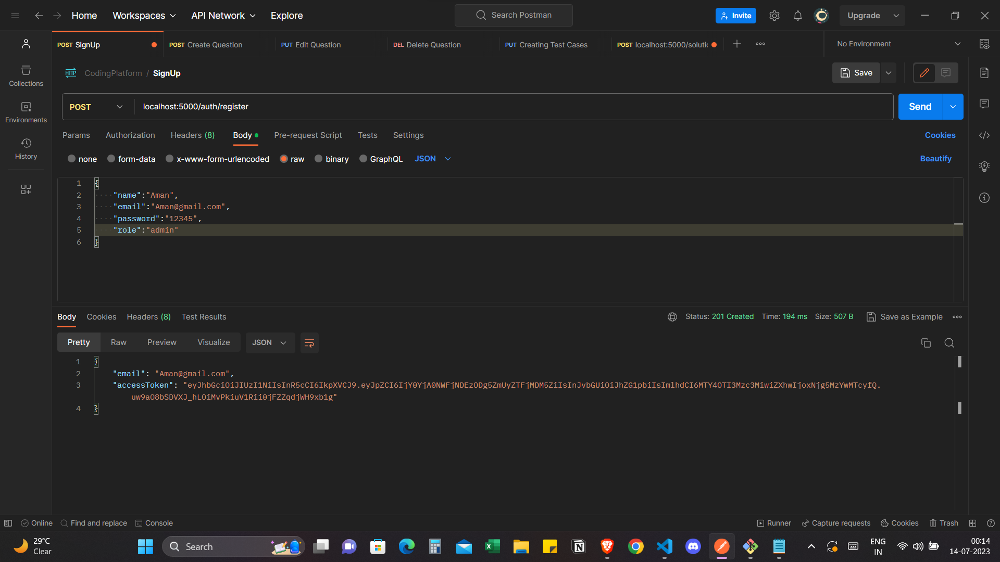
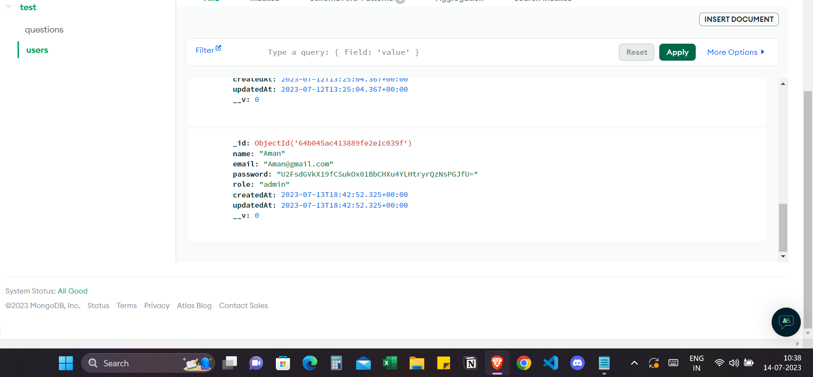
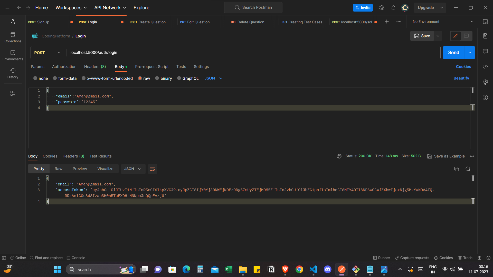
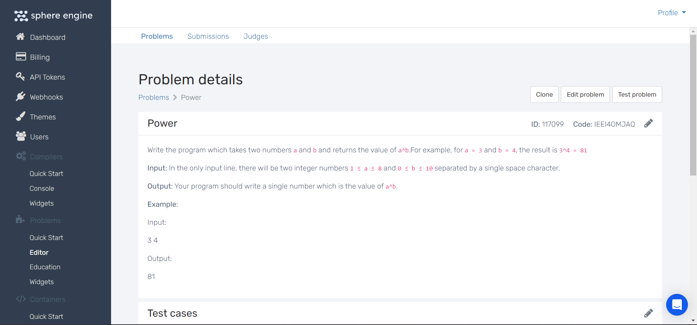
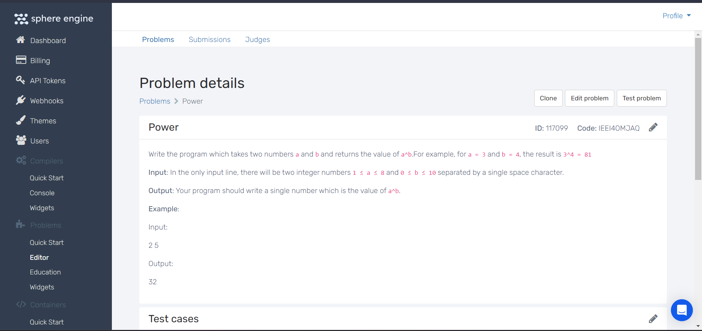
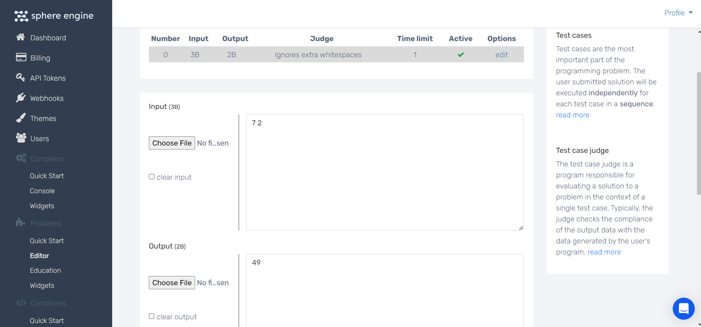

# CodingPlatform ( MERN )
- This is a Coding Platform 
- User Can Signup and make their profile ( Access token will be given with 1-day expiry ), and log in with their credentials.
- There are two types of users -> admin and participant.
- Created a middleware to differentiate admins from participants.
- Admin can Add a problem, Edit a problem, Delete a problem, and can add Test Cases to a problem.
- Problems will be maintained in DataBase ( MongoDB ) and will be simultaneously added to the **sphere engine platform** using their API. Edit and delete requests are also sent to the sphere engine via API.
- Participants can submit a solution to a problem, the solution will be sent to the **Sphere Engine** and the **Correctness**  of the solution will be given.
- Result of solution can be -> **Wrong Answer, Accepted, Compilation Error, Time limit Exceeded, Run time Error**.
- Sphere Engine **Problem Module** APIs are used for question handling and solution submission. 

## Steps to run the project locally

- clone the repo using `git clone https://github.com/Aditya-singhal03/CodingPlatform_Aditya.git`
- run `npm install` to download all dependencies.
- create the dot env file and include MONGO_URL (your mongoDB URI), Password_Security_Key,  JWT_Security_Key, Access_Token ( Acess token of the Sphere Engine )
- Now you are ready to make a request using **POSTMAN**.

  ### SignUp
  - Add name, email, password, and role ( admin, participant ). **Response** -> Access Token, Email.
    
    
    
  - User is Created in the Database.
    
    
    
  ### LogIn
  - Give email and password. **Response** -> Access Token, Email
    
    
    
  ### Add Question ( Admin Only )
  - Add **Access Token** in the header file as a token
    
   
  
  - While creating a question give each and every detail about the question involving -> **Name, Description, Input Description, Output Description, Example Case Input, Example Case Ouput**.
    
    

  - Question is also added in the **Sphere Engine**

    
    
  ### Editing Question (Admin Only )
  - Similarly add **Access Token** in the header file as a token.
  - Add the relevant changes you want to make.
    
    

  - Question is also Edited on the Sphere Engine also.
 
    
    
  ### Delete question
  
   
  
  ### Adding Test Case to a problem (Admin Only)
  - Add Access token to Header.
  - Give the input and output of the test case as a string, There is a **smarter** way of creating Test cases, add multiple test cases in one case.
   
    

  - Test Case also created on Sphere Engine
 
    
    
  ### Submitting Solution to Question (Have to be a User )
  - Add Access token in Header.
  - Add the **Code Submission** as a string in the request body. We will keep taking care of line breaks in the input Code.
  - **Response** to the submission can be ->
    ### Compilation Error
    - The code has a compilation error
      
    
    
    ### Wrong Answer
    -The Code gives the wrong Answer
    
     
    
    ### Accepted
    - The code is Accepted ( Passed )
      
      

    
